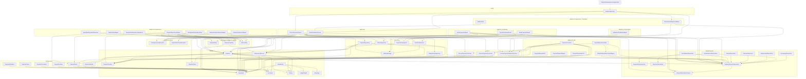

# Dependency graph

Class-level dependency graph for `com.emrekiziltoprak.payment.gateway.service`, generated from the actual import graph. Grouped by package to mirror the hexagonal layering.

```mermaid
flowchart TD

subgraph Domain["domain"]
  Payment
  PaymentId
  AccountId
  Money
  PaymentProvider
  PaymentStatus
  LedgerEntry
  LedgerEntryId
  EntryType
  IdempotencyRecord
end

subgraph DomainLifecycle["domain.lifecycle"]
  PaymentLifecycleObservation
  LifecycleObservationContext
  ProcessingObservation
  ActionRequiredObservation
  AuthorizationObservation
  CaptureObservation
  FailureObservation
  CancellationObservation
  RequiredPaymentAction
  PaymentCancellation
end

subgraph DomainEvent["domain.event"]
  PaymentEvent
  PaymentInitiated
  PaymentPending
  PaymentSucceeded
  PaymentFailed
  PaymentRefunded
end

subgraph DomainException["domain.exception"]
  GatewayTimeoutException
  PaymentNotFoundException
end

subgraph PortsIn["ports.in"]
  ProcessPaymentCommand
  ProcessPaymentUseCase
  ProcessPaymentCallbackUseCase
end

subgraph PortsOut["ports.out"]
  PaymentGatewayPort
  PaymentRepository
  IdempotencyRepository
  OutboxRepository
  OutboxMessage
  EventPublisherPort
end

subgraph Application["application"]
  ProcessPaymentService
  OutboxPublisherService
end

subgraph Config["config"]
  BeanConfiguration
end

subgraph AdaptersInWeb["adapters.in.web"]
  PaymentController
  StripeWebhookController
  StripeWebhookObservationMapper
  PaymentRequestDTO
  PaymentRequestMapper
  PaymentResponseDTO
end

subgraph AdaptersInOther["adapters.in.transaction / .scheduling"]
  TransactionalPaymentCallback
  OutboxPoller
end

subgraph AdaptersOutGateway["adapters.out.gateway"]
  StripePaymentAdapter
  IyzicoPaymentAdapter
  PaymentGatewayRouter
end

subgraph AdaptersOutMessaging["adapters.out.messaging"]
  KafkaEventPublisherAdapter
end

subgraph AdaptersOutPersistence["adapters.out.persistence"]
  PaymentRepositoryAdapter
  IdempotencyPersistenceAdapter
  OutboxPersistenceAdapter
  OutboxEntityMapper
  SpringDataPaymentRepository
  SpringDataIdempotencyRepository
  SpringDataOutboxRepository
end

subgraph Entities["adapters.out.persistence.entitites"]
  PaymentEntity
  IdempotencyEntity
  OutboxEntity
end

Main[PaymentGatewayServiceApplication]

%% ---- Domain internal ----
Payment --> PaymentId
Payment --> AccountId
Payment --> Money
Payment --> PaymentProvider
Payment --> PaymentStatus
Payment --> PaymentEvent
Payment --> PaymentInitiated
Payment --> PaymentLifecycleObservation
LedgerEntry --> LedgerEntryId
LedgerEntry --> PaymentId
LedgerEntry --> AccountId
LedgerEntry --> Money
LedgerEntry --> EntryType
IdempotencyRecord --> PaymentId
PaymentEvent --> PaymentId
PaymentInitiated --> PaymentId
PaymentInitiated --> AccountId
PaymentInitiated --> Money
PaymentPending --> PaymentId
PaymentSucceeded --> PaymentId
PaymentFailed --> PaymentId
PaymentRefunded --> PaymentId

%% ---- Domain.lifecycle internal ----
PaymentLifecycleObservation --> LifecycleObservationContext
ProcessingObservation --> PaymentLifecycleObservation
ActionRequiredObservation --> PaymentLifecycleObservation
ActionRequiredObservation --> RequiredPaymentAction
AuthorizationObservation --> PaymentLifecycleObservation
CaptureObservation --> PaymentLifecycleObservation
FailureObservation --> PaymentLifecycleObservation
CancellationObservation --> PaymentLifecycleObservation
CancellationObservation --> PaymentCancellation

%% ---- Ports.in internal ----
ProcessPaymentCommand --> AccountId
ProcessPaymentCommand --> Money
ProcessPaymentCommand --> PaymentProvider
ProcessPaymentUseCase --> PaymentId
ProcessPaymentCallbackUseCase --> PaymentLifecycleObservation

%% ---- Ports.out internal ----
PaymentGatewayPort --> Payment
PaymentGatewayPort --> PaymentLifecycleObservation
PaymentRepository --> Payment
PaymentRepository --> PaymentId
PaymentRepository --> PaymentProvider
PaymentRepository --> IdempotencyRecord
PaymentRepository --> PaymentEvent
IdempotencyRepository --> PaymentId
EventPublisherPort --> OutboxMessage

%% ---- Application ----
ProcessPaymentService --> ProcessPaymentUseCase
ProcessPaymentService --> ProcessPaymentCallbackUseCase
ProcessPaymentService --> ProcessPaymentCommand
ProcessPaymentService --> PaymentLifecycleObservation
ProcessPaymentService --> Payment
ProcessPaymentService --> PaymentId
ProcessPaymentService --> PaymentStatus
ProcessPaymentService --> IdempotencyRecord
ProcessPaymentService --> GatewayTimeoutException
ProcessPaymentService --> PaymentNotFoundException
OutboxPublisherService --> EventPublisherPort
OutboxPublisherService --> OutboxRepository
OutboxPublisherService --> OutboxMessage

%% ---- Config wiring ----
BeanConfiguration --> ProcessPaymentService
BeanConfiguration --> OutboxPublisherService
BeanConfiguration --> TransactionalPaymentCallback
BeanConfiguration --> ProcessPaymentCallbackUseCase

%% ---- Adapters.in ----
PaymentController --> ProcessPaymentUseCase
PaymentController --> ProcessPaymentCommand
PaymentController --> PaymentId
PaymentController --> AccountId
PaymentController --> Money
PaymentController --> PaymentProvider
StripeWebhookController --> ProcessPaymentCallbackUseCase
StripeWebhookController --> PaymentLifecycleObservation
StripeWebhookController --> StripeWebhookObservationMapper
StripeWebhookObservationMapper --> PaymentLifecycleObservation
StripeWebhookObservationMapper --> LifecycleObservationContext
TransactionalPaymentCallback --> ProcessPaymentCallbackUseCase
TransactionalPaymentCallback --> PaymentLifecycleObservation
OutboxPoller --> OutboxPublisherService

%% ---- Adapters.out.gateway ----
StripePaymentAdapter --> PaymentGatewayPort
StripePaymentAdapter --> Payment
StripePaymentAdapter --> PaymentLifecycleObservation
StripePaymentAdapter --> LifecycleObservationContext
StripePaymentAdapter --> GatewayTimeoutException
IyzicoPaymentAdapter --> PaymentGatewayPort
IyzicoPaymentAdapter --> Payment
IyzicoPaymentAdapter --> PaymentLifecycleObservation
IyzicoPaymentAdapter --> LifecycleObservationContext
IyzicoPaymentAdapter --> GatewayTimeoutException
PaymentGatewayRouter --> PaymentGatewayPort
PaymentGatewayRouter --> PaymentLifecycleObservation
PaymentGatewayRouter --> Payment

%% ---- Adapters.out.messaging ----
KafkaEventPublisherAdapter --> EventPublisherPort
KafkaEventPublisherAdapter --> OutboxMessage

%% ---- Adapters.out.persistence ----
PaymentRepositoryAdapter --> PaymentRepository
PaymentRepositoryAdapter --> Payment
PaymentRepositoryAdapter --> PaymentId
PaymentRepositoryAdapter --> PaymentProvider
PaymentRepositoryAdapter --> IdempotencyRecord
PaymentRepositoryAdapter --> PaymentEvent
PaymentRepositoryAdapter --> PaymentEntity
PaymentRepositoryAdapter --> IdempotencyEntity
PaymentRepositoryAdapter --> OutboxEntity
IdempotencyPersistenceAdapter --> IdempotencyRepository
IdempotencyPersistenceAdapter --> IdempotencyEntity
IdempotencyPersistenceAdapter --> PaymentId
OutboxPersistenceAdapter --> OutboxRepository
OutboxPersistenceAdapter --> OutboxMessage
OutboxPersistenceAdapter --> OutboxEntity
OutboxEntityMapper --> PaymentEvent
OutboxEntityMapper --> OutboxEntity
SpringDataPaymentRepository --> PaymentEntity
SpringDataIdempotencyRepository --> IdempotencyEntity
SpringDataOutboxRepository --> OutboxEntity

%% ---- Entities ----
IdempotencyEntity --> IdempotencyRecord
IdempotencyEntity --> PaymentId

%% ---- Bootstrap ----
Main -.-> BeanConfiguration
```
